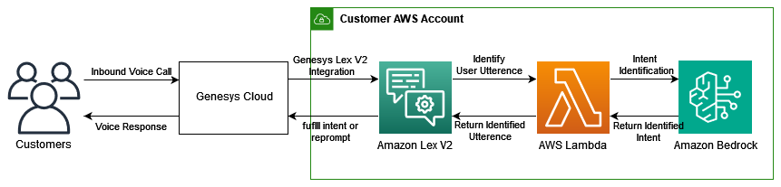
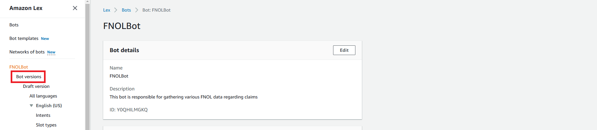

# Revolutionizing Contact Center Intelligence: A Blueprint for Genesys Cloud CX with Amazon Lex and Bedrock
## Introduction

In today's rapidly evolving customer service landscape, contact centers face unprecedented challenges in delivering exceptional customer experiences. Traditional Interactive Voice Response (IVR) systems and basic chatbots often fall short in understanding natural conversation, handling complex queries, and maintaining quality interactions in less-than-ideal conditions. This blueprint introduces a revolutionary approach that transforms these challenges into opportunities for enhanced customer engagement.

### The Evolution of Contact Center Intelligence

The integration of Genesys Cloud CX with Amazon Lex V2 and Amazon Bedrock represents a significant leap forward in contact center capabilities. This solution moves beyond simple keyword matching and rigid conversation flows, embracing the power of foundation models to create truly intelligent, adaptive, and resilient customer interactions.

### Key Challenges Addressed

1. __Complex Intent Classification__ Traditional systems struggle with nuanced customer requests that don't fit predefined patterns. Consider these real-world scenarios:

   - "My neighbor's tree fell on my garage during last night's storm, and I'm not sure if their insurance or mine should handle it."
   - "I've got water coming through the ceiling from what looks like a burst pipe in the upstairs bathroom."

   Our solution leverages foundation models to:

   - Understand context and implied intent
   - Extract relevant details from complex narratives
   - Handle multiple intents within single utterances
   - Maintain conversation context across multiple turns

2. __Intelligent Slot Resolution__ Beyond basic data collection, modern contact centers need sophisticated information gathering capabilities:

   a) Built-in Slot Handling:

   - Validates standard information formats (claim numbers, dates, etc.)
   - Ensures data quality and completeness
   - Provides immediate feedback on invalid inputs

   b) Custom Slot Intelligence:

   - Maps varied descriptions to standardized categories
   - Handles industry-specific terminology
   - Extracts multiple pieces of information from single statements
   - Validates information against business rules

3. __Background Noise Mitigation__ Real-world customer interactions rarely occur in perfect conditions. Our solution excels at:

   a) Environmental Challenges:

   - Filtering out ambient conversation
   - Managing background TV/radio noise
   - Handling multiple speaker scenarios
   - Adapting to varying audio quality

   b) Conversation Quality:

   - Maintaining context despite interruptions
   - Handling speech disfluencies (um, uh, etc.)
   - Processing partial or fragmented utterances
   - Recovering from misunderstandings

This example demonstrates a Lex bot integrated with foundation models hosted on Bedrock that gathers First Notice of Loss (FNOL) information from users who want to file insurance claims.
By combining Genesys Cloud CX's proven contact center capabilities with Amazon's advanced AI services, this blueprint provides a framework for building next-generation customer service experiences that are more intelligent, more resilient, and more effective than ever before.


## Solution Overview



The workflow consists of the following steps:

1. Customers call Genesys Contact Center. Genesys is integrated with Amazon Lex V2.  Amazon Lex NLU maps user utterances to specific intents.

2. The Lambda function is invoked at certain phases of the conversation where Amazon Lex NLU didn’t identity the user utterance, such as during the fallback intent or during slot fulfillment.

3. Lambda calls foundation models through Amazon Bedrock to identify the intent, identify the slot, or mitigate the transcribed messages from background noise.

4. Amazon Bedrock returns the identified intent or slot, or responds that it is unable to classify the utterance as one of the defined intents or slots.

5. Lambda sets the state of Amazon Lex to either move forward in the selected intent or re-prompt the user for input.

6. Amazon Lex continues the conversation by either continuing to fulfill the intent or re-prompting the user.

## Prerequisites

1. __AWS Account Requirements__:

   - Access to Amazon Lex V2
   - Access to Amazon Bedrock
   - IAM permissions for Lambda function creation
   - CloudFormation deployment permissions

2. __Genesys Cloud CX Requirements__:

   - Administrator access to Genesys Cloud CX
   - Ability to create and modify call flows
   - Integration permissions

3. __Technical Requirements__:

   - AWS CLI installed and configured
   - Python 3.12 or later
   - Basic understanding of YAML and CloudFormation

## Deployment Guide

### 1. Deploy the Amazon Lex V2 Bot

1. Clone the repository containing the CloudFormation template

2. Deploy the template using AWS CloudFormation:

   ```bash
   aws cloudformation deploy \
     --template-file insurance_bot.yaml \
     --stack-name fnol-bot \
     --capabilities CAPABILITY_IAM
   ```

3. Note the bot ID and alias from the CloudFormation outputs

### 2. Configure Genesys Integration

1. Grant Genesys the permission to call Amazon Lex V2 bot

Follow these instructions : https://help.mypurecloud.com/articles/amazon-lex-v2-quick-start-guide/ . Complete Step 2, Step 3 and Step 4

2. Create a Genesys Cloud Architect flow and configure it with an Amazon Lex V2 bot

Follow these instructions : https://help.mypurecloud.com/articles/amazon-lex-v2-quick-start-guide/ . Complete Step 5. Select the 'FNOLBot' that you created in Lex.

3. Use Genesys Cloud to call the inbound call flow

Follow these instructions : https://help.mypurecloud.com/articles/amazon-lex-v2-quick-start-guide/ . Complete Step 6.


## Interacting with Insurance bot

To interact with the bot, navigate to FNOLBot on the Amazon Lex console and open a test window. Refer to below screenshots for step-by-step guide.





Now, we can test the solution from the test window. The following screenshots display an example for each of the scenario mentioned previously.

### Intent identification


Note that the Lex bot identifies intent as `GatherFNOLInfo` even when the provided utterance differs substantially from the intent's sample utterances.

### Assisted slot resolution for custom slots


Note that the Lex bot correctly identifies all slot values as `roof` and `concussion`, even though the provided utterances differs substantially from the slot values.

### Background noise mitigation


Note that the Lex bot correctly identifies intent and all slot values, even though the provide utterances include inputs from background noises.

## Cleanup

To avoid incurring future charges, delete the CloudFormation stack when you are finished.


## Conclusion

In this example, we demonstrated how to set up Amazon Lex and Amazon Bedrock for an insurance chatbot experience with validation layer. This enables the chatbot to collect intent and slot from potentially out-of-band responses provided by end users without having to re-prompt, allowing for more seamless customer experiences. As seen from examples, if user provides utterance that are outside of bot's NLU training data, the LLM is able to step in and correctly identify the user's intent and slot for Lex bot.

If you have an existing Amazon Lex bot deployed, you can edit the code and prompts attached to Lambda function to enhance the bot for your specific use cases. Try it out and let us know if you have any questions or suggestions!

